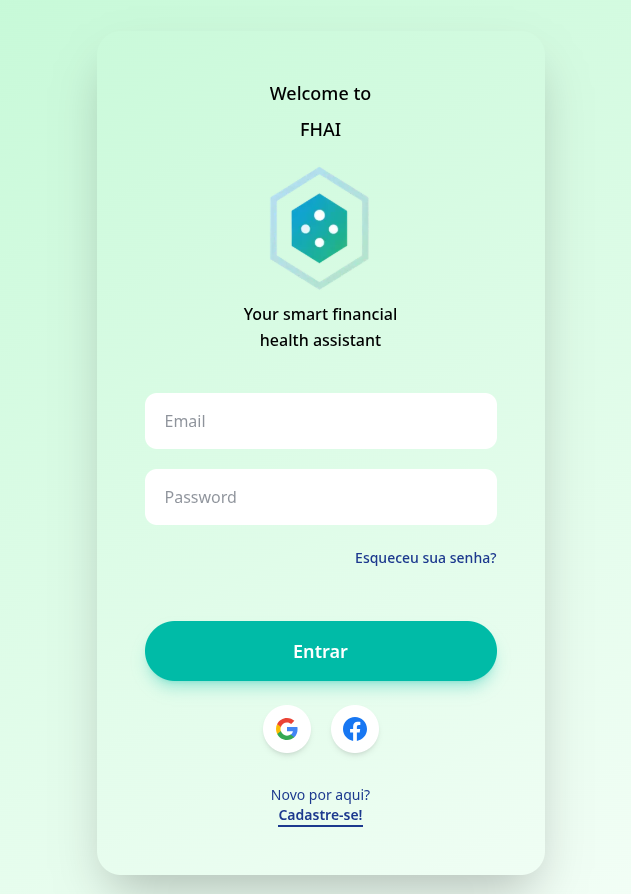
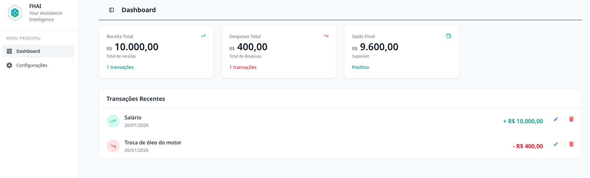
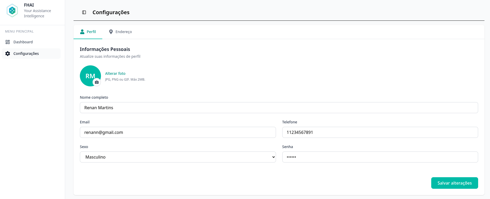
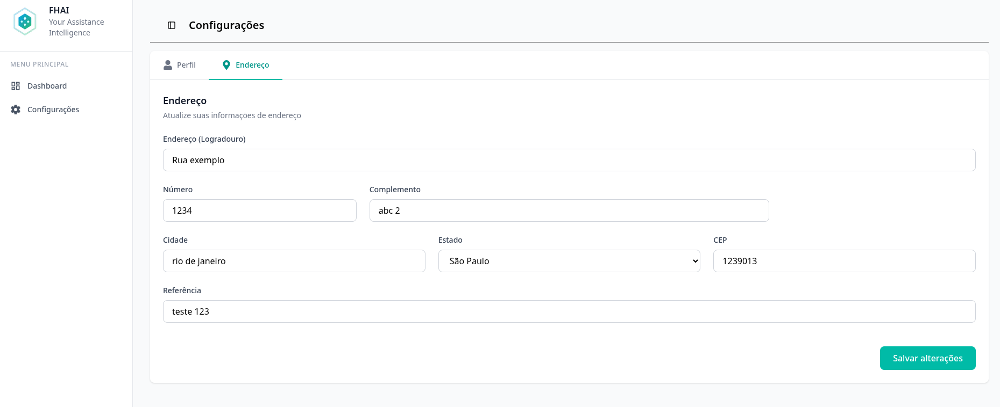

# FHAI - Sistema de Controle Financeiro


## 📋 Sobre o Projeto

FHAI é um sistema de controle financeiro desenvolvido como projeto acadêmico do curso de Análise e Desenvolvimento de Sistemas da FIAP. A aplicação permite aos usuários gerenciar suas finanças pessoais de forma simples e intuitiva, com funcionalidades de cadastro de transações, perfil de usuário e endereços.

### 🎯 Objetivo

Facilitar o controle financeiro pessoal através de uma interface moderna e responsiva, permitindo o registro, visualização e gerenciamento de receitas e despesas.

---

## ✨ Funcionalidades

### Nova Conta / Login




### 💰 Gerenciamento de Transações



- ✅ Cadastro de receitas e despesas
- ✅ Visualização de histórico de transações
- ✅ Edição de transações
- ✅ Exclusão de transações

### 👤 Gerenciamento de Usuários



- ✅ Cadastro de novos usuários
- ✅ Login e autenticação
- ✅ Edição de dados pessoais
- ✅ Exclusão de conta

### 📍 Gerenciamento de Endereços



- ✅ Cadastro de endereços
- ✅ Edição de endereços
- ✅ Exclusão de endereços
- ✅ Múltiplos endereços por usuário

---

## 🛠️ Tecnologias Utilizadas

### Backend

- **Java** - Linguagem de programação
- **Spring Boot** - Framework para desenvolvimento de APIs REST
- **JPA/Hibernate** - ORM para persistência de dados
- **Oracle Database** - Banco de dados relacional
- **Maven** - Gerenciador de dependências

### Frontend

- **React** - Biblioteca JavaScript para construção de interfaces
- **TypeScript** - Superset JavaScript com tipagem estática
- **Next.js** - Framework React para aplicações web
- **TailwindCSS** - Framework CSS utility-first
- **Context API** - Gerenciamento de estado global

---

## 🚀 Como Executar o Projeto

### Pré-requisitos

- **Java JDK 17+**
- **Node.js 18+**
- **Oracle Database**
- **Maven**
- **Git**

### Clonando o Repositório

```bash
git clone git@github.com:Rfresatto/fhai-fintech.git
cd fhai-fintech
```

---

## ⚙️ Configuração do Backend

### 1. Navegue até a pasta do backend

```bash
cd sistema-fhai-spring-boot-main
```

### 2. Configure o arquivo `.env` ou `application.properties`

```properties
# Configurações do Banco de Dados
spring.datasource.url=jdbc:oracle:thin:@oracle.fiap.com.br:1521:ORCL
spring.datasource.username=RM562801
spring.datasource.password=041198

# Porta do servidor
server.port=8080

# JPA/Hibernate
spring.jpa.hibernate.ddl-auto=update
spring.jpa.show-sql=true
```

### 3. Execute o backend

```bash
mvn clean install
mvn spring-boot:run
```

O backend estará rodando em: `http://localhost:8080`

---

## 🎨 Configuração do Frontend

### 1. Navegue até a pasta do frontend

```bash
cd fhai-front
```

### 2. Instale as dependências

```bash
npm install
```

### 3. Configure o arquivo `.env`

```env
NEXT_PUBLIC_API_URL=http://localhost:8080
```

### 4. Execute o frontend

```bash
npm run dev
```

O frontend estará rodando em: `http://localhost:3000`

---

## 💡 Funcionalidades Implementadas

### Autenticação e Sessão

- ✅ Sistema de login simples
- ✅ Armazenamento de dados do usuário no localStorage
- ✅ Context API para gerenciamento global de estado

### Interface do Usuário

- ✅ Design responsivo com TailwindCSS
- ✅ Navegação intuitiva
- ✅ Feedback visual para ações do usuário
- ✅ Validação de formulários

## 🎓 Equipe

### Integrantes

| Nome                         | RM       |
| ---------------------------- | -------- |
| Renan Fresatto Martins       | RM562801 |
| Julio Cesar Bastos de Vargas | RM562121 |
| João Ricardo Fidelix         | RM555568 |
| Miguel Siqueira de Lima      | RM564124 |
| Arthur Tassinari Resende     | Rm555568 |

### Curso

**Análise e Desenvolvimento de Sistemas - FIAP**

**Ano:** 2025

---

## 📝 Licença

Este projeto foi desenvolvido para fins acadêmicos como parte do curso de Análise e Desenvolvimento de Sistemas da FIAP.

---

## 🔄 Melhorias Futuras

- [ ] Implementação de JWT para autenticação mais segura
- [ ] Dashboard com gráficos de receitas e despesas
- [ ] Relatórios em PDF
- [ ] Filtros avançados de transações por período
- [ ] Categorização de transações
- [ ] Metas financeiras
- [ ] Notificações de vencimento
- [ ] Modo escuro
- [ ] Aplicativo mobile

---

⭐ **Desenvolvido com dedicação pela equipe FHAI**
